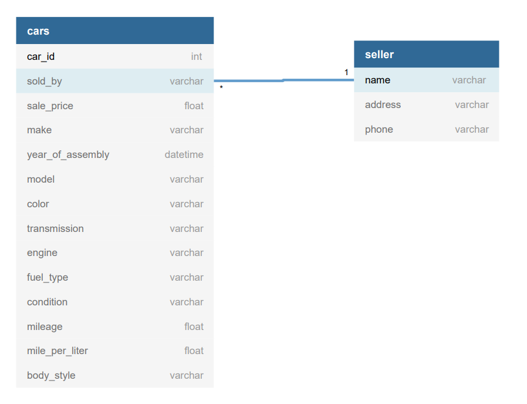

# Autolist

##Project Description

Scraping project using info from autolist

The website being used for this project is www.Autolist.com
It's a website with information about used cars on sale.

We chose as a starting point convertible cars within a 50 miles range 
from New York, NY.

Then we located the parts on the webpage that would allow us to go through
it scrapping.

By analysing the html files, we could get the links to each individual ad.
In every ad page we located all of the useful information to save.
We then located the html element to go to the next page and look for
the links again until there are no more pages with data to search.


After that we wrote functions to allow us to do all of those parts.
	1 - To loop through all the the adds;
	2 - To get the information from each ad;
	3 - To go to the next search page;
	4 - To repeat the process until there's no more pages.


## Clases made
We made three clases in our project.

Car: A class that models cars and the relevent information we
get from the Autolist webpage.

Seller: A class that models the car sellers and the relevant information
we get from the Autolist webpage.

Autolist_DBM: A class that manages the DataBase with
the relevant information of Autolist.

###Prerequisites

Pymysql was used to wrap up the mysql commands

```bazaar
pip install pymysql
```

Beautiful Soup and Selenium was used to Scrap Autolist.

```bazaar
pip install bs4
```

```bazaar
pip install selenium
```

###Command Line Commands
To use the program, use the command-line interface to determine the scope of search. 

Use -h for help.

By default, the file searches for cars in a radius of 50 miles from New York, NY. 

The parameters that are customizable through the command line interface are as follows:

-b, ---body: Add body type to search. Accepted values: “any”, “convertible”, “coupe”, “crossover”, “hatchback”, “minivan”, “sedan”, “suv”, “passenger_cargo_van”, “truck”, “wagon”

-c, --cat: Add category to search. Accepted values: “any”, “american”, “classic”, “commuter”, “electric”, “family”, “fuel_efficient”, “hybrid”, “large”, “luxury”, “muscle”, “off_road”, “small”, “sport”, “supercar”

-r, --radius: Change radius (in miles) of search. Accepted values: 10, 25, 50, 100, 150, 200, 300, 500, “any”

-pmin, --price_min: Add min price (in thousands of USD) to search. Accepted values: 1 to 100

-pmax, --price_max: Add max price (in thousands of USD) to search. Accepted values: 1 to 100

-ymin, --year_min: Add min year of car to search. Accepted values: 1940 to 2021

-ymax, --year_max: Add max year of car to search. Accepted values: 1940 to 2021

-pg, --page_max: Add max number of pages to scrape. Accepted values: integer

-a, --ads_max: Add max number of ads to scrape. Accepted values: integer

###DataBase 
A mysql database was used in order to store the relevant information wanted.
The DataBase consists on 3 Tables, "CARS","CAR_TYPE" and "SELLERS".

CARS: Stores the particular information of a specific car on sale.
CAR_TYPE: Stores the information of different car models by year (since each year the features
could change)
SELLERS: Stores the information of different car sellers.



