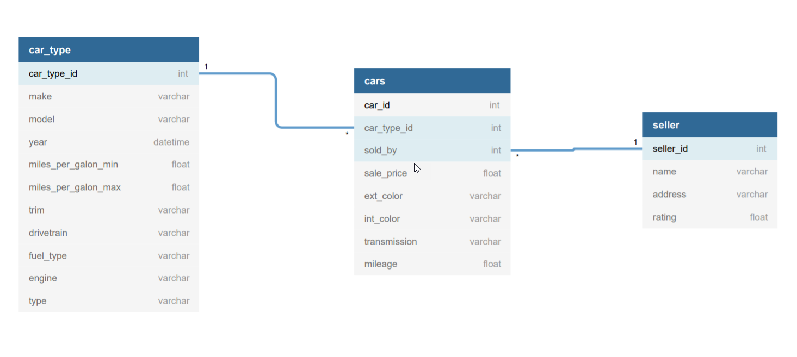

# Cars.com

##Project Description

Scraping project using info from cars.com

The website used for this project is www.cars.com. It's a website with information about cars on sale in the USA.

The program goes through ads in the website and saves relevant information to a database.

Information about the code and how to use it are as follows:

###Command Line Commands
Use the command line to determine the scope of search.

Use -h for help

---body:
**Definition**: Adds body type to search results.
**Accepted values**: "any", "cargo_van", "coupe", "convertible", "hatchback", "minivan", "passenger_van", "pickup_truck", "suv", "sedan" and "wagon"
**Default value**: "any"

--cond: 
**Definition**: Adds condition to search results. 
**Accepted values**: "all", "new", "new_cpo", "used", "cpo".
**Default value**: "all"
"cpo" is a Certified Pre-Owned car, which is a used car with quality certified by the website. 
"new_cpo" will output both new and cpo cars.

--radius: 
**Definition**: Change radius (in miles) of search. 
**Accepted values**: "10", "20", "30", "40", "50", "75", "100", "150", "200", "250", "500", "any"
**Default value**: "any"

--price_min: 
**Definition**: Add min price (in thousands of USD) to search. 
**Accepted values**: 0 to 2500
**No default value**

--price_max: 
**Definition**: Add max price (in thousands of USD) to search. 
**Accepted values**: 0 to 2500
**No default value**

--year_min:
**Definition**: Add min year of car to search. 
**Accepted values**: 1900 to 2022
**No default value**

## Clases made
We made three clases in our project.

Car: A class that models cars and the relevent information we
get from the Autolist webpage.

Seller: A class that models the car sellers and the relevant information
we get from the Autolist webpage.

Autolist_DBM: A class that manages the DataBase with
the relevant information of Autolist.

###Prerequisites

Pymysql was used to wrap up the mysql commands

```bazaar
pip install pymysql
```

Beautiful Soup and Selenium was used to Scrap Autolist.

```bazaar
pip install bs4
```

```bazaar
pip install selenium
```


###DataBase 
A mysql database was used in order to store the relevant information wanted.
The DataBase consists on 3 Tables, "CARS","CAR_TYPE" and "SELLERS".

CARS: Stores the particular information of a specific car on sale.
CAR_TYPE: Stores the information of different car models by year (since each year the features
could change)
SELLERS: Stores the information of different car sellers.



